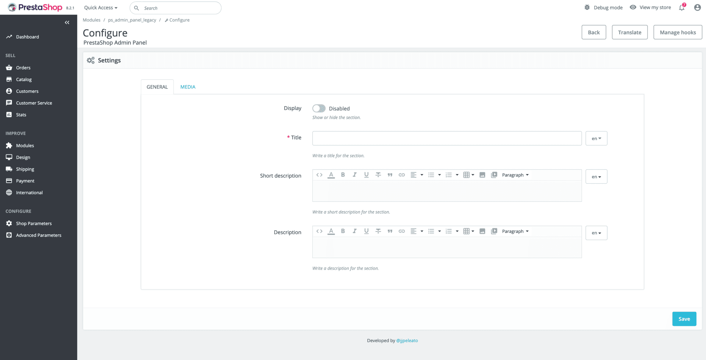

# PrestaShop: Dynamic Admin Panel

This module facilitates the creation and management of custom administration panels within PrestaShop’s back office. It automatically generates configuration forms based on the `settings.php` file, incorporating various types of fields such as text, HTML, switches, images, and videos.



### The problem

This module has been developed with the aim of simplifying and streamlining the creation of custom admin panels in PrestaShop. Typically, these tasks involve repetitive work that consumes time and resources without adding significant value to the project. Thanks to this module, much of that process is automated, allowing developers to focus on more important aspects of development.

In addition, it is specifically designed to support frontend teams, enabling them to build functional admin interfaces without directly relying on the backend team. This results in greater autonomy, reduced development time, and overall improved workflow efficiency.

### Main features

- **Automatic panel generation**: Dynamically creates admin interfaces based on the configuration in `settings.php`.
- **Multiple field types**: Supports text fields, HTML with WYSIWYG editor, switches, images and videos.
- **Tabbed organization**: Fields can be organized into different tabs.
- **Media management**: Includes upload, validation and deletion of media files (images and videos).
- **Built-in validation**: Automatically validates uploaded files and required fields.
- **Multi-language support**: Fully supports PrestaShop’s multi-language features, allowing language-specific configurations.
- **Multi-store compatibility**: This module supports PrestaShop's multi-store feature. If multistore is enabled, ensure that you select the appropriate store context before configuring the module.

### Requirements

- **PrestaShop version**: 1.7.6.0 to 8.2.1
- **PHP version**: Compatible with the PHP version required by your PrestaShop installation.

### Requirements to develop

To run this project, you must have Composer and Node.js installed, as well as a package manager such as NPM or Yarn.

For more information visit:

- Composer: https://getcomposer.org/
- Node and NPM: https://nodejs.org/es/
- Yarn: https://yarnpkg.com/es-ES/

## Installation to develop

1. Clone or download this repository into the `modules` directory of your PrestaShop installation.
   ```bash
   git clone https://github.com/jjpeleato/ps-dynamic-admin-panel.git
   ```
2. Search and replace all occurrences with your new module name throughout the project files. Remember to activate the search: "Match uppercase and lowercase".
  - Rename the module directory from `ps_dynamic_admin_panel` to `your_new_module_name`.
  - Rename the main module file from `ps_dynamic_admin_panel.php` to `your_new_module_name.php`. Remember that both must match to work correctly.
  - Replace `ps_dynamic_admin_panel` to `your_new_module_name`.
  - Replace `ps-dynamic-admin-panel` to `your-new-module-name`.
  - Replace `Ps_Dynamic_Admin_Panel` to `Your_New_Module_Name`.
  - Replace `PsDynamicAdminPanel` to `PsYourNewModuleName`.
  - Replace `PS_DYNAMIC_ADMIN_PANEL_` to `YOUR_NEW_MODULE_NAME_`.
  - Replace `Modules.Psdynamicadminpanel.Admin` to `Modules.Yournewmodulename.Admin`.
  - Rename the `AdminDynamicPanelController` file to `AdminYourNewModuleNameController`. Remember that it is mandatory to use the prefix `Admin` and the suffix `Controller`.
  - Update the `PS_DYNAMIC_ADMIN_PANEL_NAME` constant in `settings.php` to use the exact same name `AdminYourNewModuleName`. Both must match for the panel to work correctly.
3. Navigate to the module directory:
   ```bash
   cd modules/ps_dynamic_admin_panel
   ```
4. Install the dependencies using Composer:
   ```bash
   composer install
   ```
5. Install the Node.js dependencies:
   ```bash
   npm install --save-dev
   ```
6. Install the module in PrestaShop's back office.
7. Clear the PrestaShop cache to ensure the module is recognized.
8. End and happy coding!

### Configure file `settings.php`

The `settings.php` file is the core of the module's configuration. It is used to define the structure and content of the admin panel, and should be placed in the root directory of the module.

Currently, the module supports five field types: `switch`, `text`, `html`, `video` and `image`. To add, modify, or remove fields in the admin panel, you need to use the constant `PS_DYNAMIC_ADMIN_PANEL_FIELDS`.

As a reference, you can check the `settings.php` file, which includes a complete example with all available configuration options for the fields.

```php
const PS_DYNAMIC_ADMIN_PANEL_FIELDS = [
    'PS_DYNAMIC_ADMIN_PANEL_DISPLAY' => [
        'machine_name' => 'display', // Unique identifier for the field. Used as a variable in the FO.
        'tab' => 'general', // Tab where the field will be displayed in the BO.
        'type' => 'switch', // Type of field (switch, text, html, video, image).
        'lang' => false, // Indicates if the field is language-specific.
        'required' => false, // Indicates if the field is required.
        'label' => 'Display', // Label for the field.
        'desc' => 'Show or hide the section.', // Description of the field.
        'value' => 0, // Default value for the field.
    ],
];
```

### Usage the module

To use the module, follow these steps:

1. Install the module in the PrestaShop back office.
   - Go to the "Modules" section and click on "Module Manager".
   - Search for `PrestaShop: Dynamic Admin Panel` and install it.
   - If you have renamed the module, ensure that you search for the new name.
2. Navigate to the module configuration page.
3. Add content in the back office using the provided fields and save the changes.
5. Use the widget `{widget name="ps_dynamic_admin_panel"}` wherever you want to display the html block.

### Project structure

```
ps_dynamic_admin_panel/
├── .husky/ # Husky hooks for Git
│   ├── commit-msg
│   ├── post-merge
│   ├── post-rewrite
│   └── pre-commit
├── classes/
│   ├── HelperFormExtended.php # Extended helper form class for custom fields
│   ├── ImageHandler.php # Class for handling image uploads
│   ├── index.php
│   ├── Installer.php # Installer class for setting up the module
│   ├── MediaHandler.php # Class for managing media files (images and videos)
│   ├── TabInstaller.php # Class for installing tabs in the admin panel
│   ├── Uninstaller.php # Uninstaller class for cleaning up the module
│   └── VideoHandler.php # Class for handling video uploads
├── controllers/
│   ├── admin/
│   │   ├── AdminDynamicPanelController.php # Handles the AJAX request to delete media files
│   │   └── index.php
│   └── index.php
├── upload/ # Directory for uploaded media files
│   └── index.php
├── views/ 
│   ├── js/
│   │   ├── custom.js
│   │   └── index.php
│   ├── templates/
│   │   ├── admin/
│   │   │   ├── _configure/
│   │   │   │   ├── helpers/
│   │   │   │   │   ├── form/
│   │   │   │   │   │   ├── form.tpl
│   │   │   │   │   │   └── index.php
│   │   │   │   │   └── index.php
│   │   │   │   └── index.php
│   │   │   ├── index.php
│   │   │   └── index.tpl
│   │   ├── widget/
│   │   │   ├── index.php
│   │   │   └── index.tpl
│   │   └── index.php
│   └── index.php
├── .editorconfig
├── .gitignore
├── .prettierignore
├── commitlint.config.cjs
├── composer.json
├── config.xml
├── index.php
├── LICENSE
├── logo.png
├── package.json
├── phpcs.xml
├── ps_dynamic_admin_panel.php # Main module file
├── README.md
└── settings.php # Configuration file for the module
```

## Technologies and tools

This project utilizes various technologies and tools for automation and the development process. For more details and learning resources, please refer to the following links.

1. Git: https://git-scm.com/
2. PHP: https://www.php.net/
3. MariaDB: https://mariadb.org/
4. Apache: https://www.apache.org/
5. Docker: https://www.docker.com/
6. Lando: https://docs.devwithlando.io/
7. PrestaShop: https://prestashop.com/
8. Composer: https://getcomposer.org/
9. PHP_CodeSniffer: https://github.com/squizlabs/PHP_CodeSniffer
10. Node.js: https://nodejs.org/
11. NPM: https://www.npmjs.com/
12. Yarn: https://yarnpkg.com/
13. Gulp: https://gulpjs.com/
14. EditorConfig: https://editorconfig.org/
15. Husky: https://www.npmjs.com/package/husky
16. Commitlint: https://commitlint.js.org/
17. Commitizen: http://commitizen.github.io/cz-cli/

**Note:** Many thanks to all the developers who worked on these projects.

## Contributing

Contributions are welcome! Please follow the coding standards defined in `phpcs.xml` and ensure all changes are tested before submitting a pull request. Use the https://validator.prestashop.com/ tool for your commits, and ensure that your code passes the PrestaShop coding standards.

## Support

For issues or feature requests, please open an issue in the repository or contact with me directly.

## Acknowledgments

If you find this module useful, feel free to leave a star as a sign of support. You're also welcome to share your feedback in the PrestaShop forums—both in the [Spanish-speaking](https://www.prestashop.com/forums/topic/1100262-m%C3%B3dulo-gratuito-crea-paneles-de-administraci%C3%B3n-din%C3%A1micos-en-prestashop-1760-hasta-821/) thread and the one for the [English-speaking](https://www.prestashop.com/forums/topic/1100261-free-module-create-dynamic-admin-panels-in-prestashop-from-1760-to-821/) community, where I’ve shared the module. Your opinion is always appreciated!

## Finally

More information on the following commits. If required.

Grettings **@jjpeleato**.
